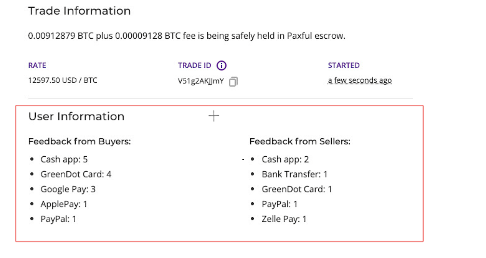
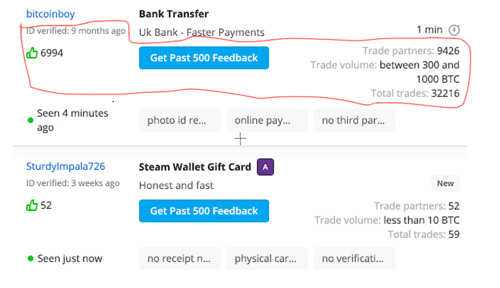
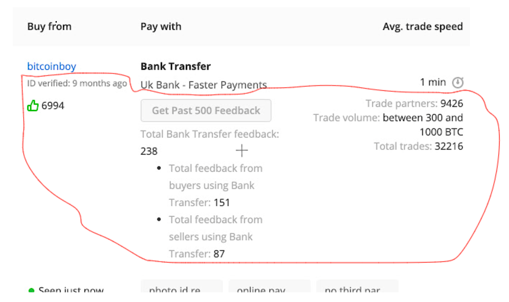

# Paxful Helper 

## What is Paxful Helper?

Paxful Helper is a Google chrome extension that scrapes and calculates data / profile information off of other users profile page, which it then formats and displays it directly onto the page.

The highlighted sections are the additional content that will be generated to the page when you download the extension.

### Trade window with a user:

### Browsing buy/sell page:

*After clicking the 'Get Feedback' button*

> The 'get past 500 feedback' button displays the number of feedbacks, from the 500 most recent feedback, that matches the payment type offered by the user

## Download link

~~Chrome Store: https://chrome.google.com/webstore/detail/paxful-helper/inmmpimgdldcgmcglgoplllhpnkhlfja?hl=en~~

The link is no longer valid as the project has been discontinued and as a result have been removed from the chrome store. It had about ~20 active users.
